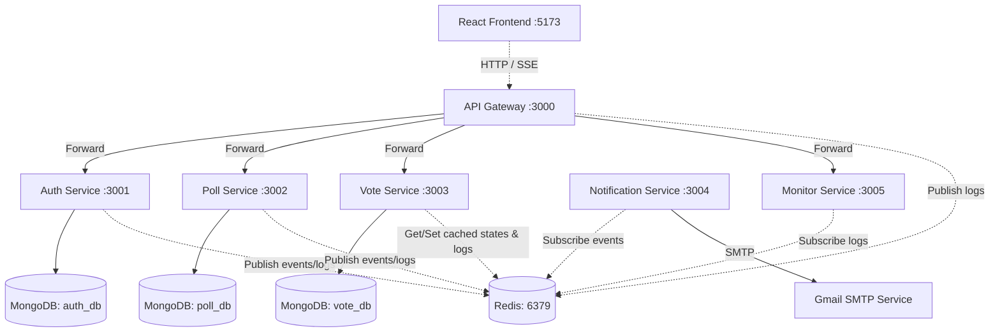
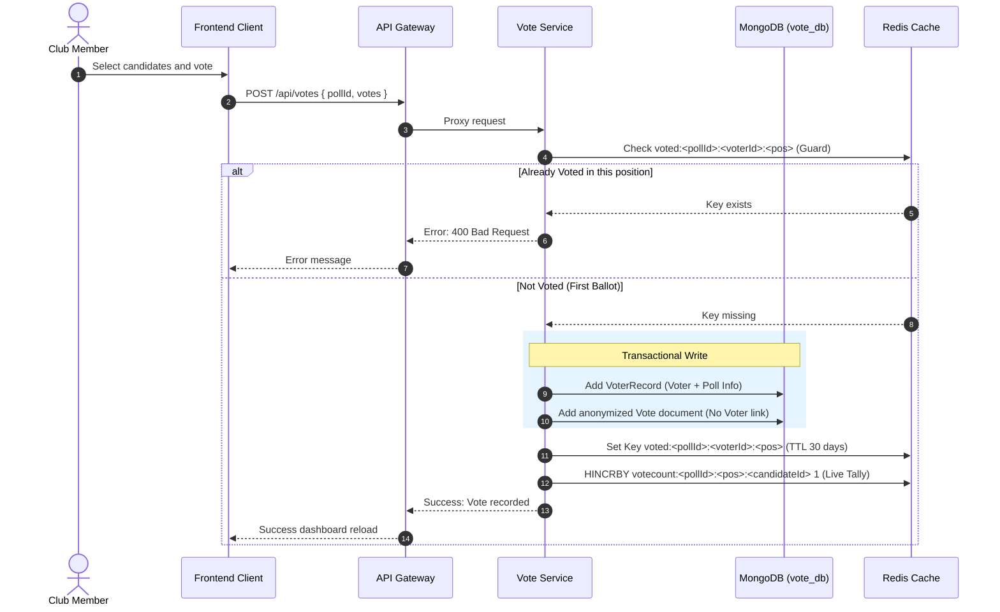
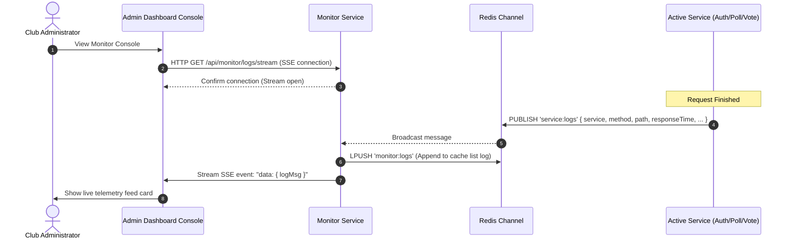

# 🗳️ Aveon Club Polling System — Backend

Microservices backend for club elections (President, GenSec, etc.) built with **Express.js**, **MongoDB**, and **Redis**.

---

## 📐 High-Level Design (HLD)

This section describes the system design, microservices architecture, component schemas, and communication flows of the AVEON Polling System.

### System Architecture

The project is structured as a decoupled microservices architecture utilizing Node.js/Express for services, Redis for fast pub/sub operations, cached stores, and double-vote checks, and MongoDB as the persistent data container. 



### Component Breakdown

1. **API Gateway (`packages/gateway`)**:
   - Single endpoint exposing entry to clients (`http://localhost:3000`).
   - Handles route proxying, rate-limiting, and CORS configurations.
   - Logs incoming requests asynchronously into Redis channel `service:logs`.

2. **Auth Service (`packages/auth-service`)**:
   - Handles creation, distribution, and validation of member invitation links.
   - Generates stateless JWT access tokens and Redis-backed stateful refresh sessions.
   - Restores user validation checks.

3. **Poll Service (`packages/poll-service`)**:
   - Stores general structures for polls, metadata, available voter positions, and candidates.
   - Deploys multi-layered Redis caching for speedier listing endpoints.

4. **Vote Service (`packages/vote-service`)**:
   - Handles the entire voting engine.
   - Guarantees complete anonymity by splitting ballot entries from voter identity tables.
   - Updates live voting tallies in Redis directly.

5. **Notification Service (`packages/notification-service`)**:
   - A message-driven engine listening for `poll:events` published by services.
   - Automates the distribution of email updates (e.g. invites, poll open, poll results ready) using SMTP.

6. **Monitor Service (`packages/monitor-service`)**:
   - Collects logs pushed to Redis from active services.
   - Caches standard logs (up to 2,000 entries) and maintains a heartbeat interface for all microservices.
   - Services Server-Sent-Events (SSE) logs connection to the frontend monitor console.

### Database Design & Schema Models

Different MongoDB instances isolate service databases to maintain domain boundary encapsulation:

- **`auth_db`**:
  - `users`: `{ name, email, passwordHash, membershipId, role, isActive }`
  - `invites`: `{ email, name, membershipId, role, token, used, expiresAt }` (invite tokens are UUIDv4 base)
- **`poll_db`**:
  - `polls`: `{ title, description, status ('draft','active','closed'), positions: [{ name, candidates: [{ name, membershipId, bio, photoUrl }] }] }`
- **`vote_db`**:
  - `voter_records`: `{ pollId, voterId, votedPositions: [String] }` (stores who voted to block duplicate entries)
  - `votes`: `{ pollId, positionName, candidateId, castedAt }` (anonymized vote registry containing no references to `voterId`)

---

### Core Data Flows

#### 1. Anonymous Voting Mechanism
To ensure absolute voter privacy, the Voting transaction creates two detached records and updates memory tallies:



#### 2. Log Stream & Telemetry Flow
Request events are automatically published to Redis and surfaced dynamically in the administration console using SSE streams:



---

## Quick Start

### Prerequisites
- [Docker Desktop](https://www.docker.com/products/docker-desktop/) installed and running

### 1. Clone & setup environment
```bash
cd Aveon_Polling
cp .env.example .env
```

### 2. Fill in `.env`
```env
JWT_SECRET=a-very-long-random-secret-key-change-this
GMAIL_USER=your-club-email@gmail.com
GMAIL_APP_PASSWORD=xxxx-xxxx-xxxx-xxxx    # Google App Password (not your Gmail password)
FRONTEND_URL=http://localhost:5173
```

> **Gmail App Password Setup**: Go to Google Account → Security → 2-Step Verification → App passwords → Create one for "Mail"

### 3. Start everything
```bash
npm run start:build     # First time (builds Docker images)
npm run start           # Subsequent runs
```

All services start at:
- `http://localhost:3000` → API Gateway (use this for all requests)

### 4. Stop
```bash
npm run stop            # Keep data
npm run stop:volumes    # Wipe all data
```

---

## API Reference

**Base URL**: `http://localhost:3000/api`  
**Auth Header**: `Authorization: Bearer <accessToken>`

---

### Auth Endpoints

| Method | Path | Auth | Description |
|---|---|---|---|
| `POST` | `/auth/login` | Public | Login with email + password |
| `POST` | `/auth/register` | Public | Register using invite token |
| `POST` | `/auth/refresh` | Public | Get new access token |
| `POST` | `/auth/logout` | Member | Logout (invalidates token) |
| `GET` | `/auth/me` | Member | Get own profile |
| `POST` | `/auth/invite` | Admin | Send invite email to member |
| `GET` | `/auth/invites` | Admin | List all invites |
| `GET` | `/auth/users` | Admin | List all users |
| `PATCH` | `/auth/users/:id/role` | Admin | Change user role |
| `DELETE` | `/auth/users/:id` | Admin | Deactivate user |

**Login request:**
```json
POST /api/auth/login
{ "email": "admin@club.com", "password": "password123" }
```

**Send invite (admin):**
```json
POST /api/auth/invite
{ "email": "newmember@college.edu", "name": "Rahul Sharma", "membershipId": "BIT2024001", "role": "member" }
```

**Register (member uses invite link):**
```json
POST /api/auth/register
{ "token": "<uuid-from-email>", "password": "mypassword", "confirmPassword": "mypassword" }
```

---

### Poll Endpoints

| Method | Path | Auth | Description |
|---|---|---|---|
| `GET` | `/polls` | Member | List active polls |
| `GET` | `/polls/:id` | Member | Get poll details with candidates |
| `POST` | `/polls` | Admin | Create new poll |
| `PATCH` | `/polls/:id/status` | Admin | Open (`active`) or close (`closed`) poll |
| `POST` | `/polls/:id/positions` | Admin | Add a position (e.g. "President") |
| `POST` | `/polls/:id/positions/:name/candidates` | Admin | Add candidate to position |
| `DELETE` | `/polls/:id/positions/:name/candidates/:cId` | Admin | Remove candidate |
| `DELETE` | `/polls/:id` | Admin | Delete poll (not if active) |

**Create poll:**
```json
POST /api/polls
{
  "title": "BIT Mesra Club Elections 2025",
  "description": "Annual elections for club leadership positions"
}
```

**Add position:**
```json
POST /api/polls/:id/positions
{ "positionName": "President" }
```

**Add candidate:**
```json
POST /api/polls/:id/positions/President/candidates
{
  "name": "Arjun Mehta",
  "membershipId": "BIT2023045",
  "bio": "3rd year, passionate about innovation",
  "photoUrl": "https://example.com/photo.jpg"
}
```

**Open poll for voting:**
```json
PATCH /api/polls/:id/status
{ "status": "active" }
```

---

### Vote Endpoints

| Method | Path | Auth | Description |
|---|---|---|---|
| `POST` | `/votes` | Member | Cast votes (anonymous) |
| `GET` | `/votes/status/:pollId` | Member | Check which positions I've voted in |
| `GET` | `/votes/results/:pollId` | Member/Admin | Results (member: after close only) |
| `GET` | `/votes/live/:pollId` | Admin | Live vote counts from Redis |

**Cast vote:**
```json
POST /api/votes
{
  "pollId": "65abc123...",
  "votes": [
    { "positionName": "President", "candidateId": "65abc456..." },
    { "positionName": "General Secretary", "candidateId": "65abc789..." }
  ]
}
```

**Results response:**
```json
{
  "pollId": "...",
  "pollTitle": "BIT Mesra Club Elections 2025",
  "status": "closed",
  "results": [
    {
      "positionName": "President",
      "totalVotes": 47,
      "winner": { "name": "Arjun Mehta", "votes": 30 },
      "candidates": [
        { "name": "Arjun Mehta", "votes": 30 },
        { "name": "Priya Singh", "votes": 17 }
      ]
    }
  ]
}
```

---

## Typical Admin Flow

```
1. Admin logs in
2. Admin sends invites to all club members (POST /auth/invite)
3. Members receive email → click link → register with password
4. Admin creates poll (POST /polls)
5. Admin adds positions: President, GenSec, etc. (POST /polls/:id/positions)
6. Admin adds candidates to each position
7. Admin opens poll (PATCH /polls/:id/status { status: "active" })
   → All members receive email notification
8. Members log in → view poll → cast votes (POST /votes)
   → Votes are 100% anonymous
9. Admin closes poll (PATCH /polls/:id/status { status: "closed" })
   → All members receive email notification
10. Members view results (GET /votes/results/:pollId)
```

---

## Anonymous Voting Design

> ⚠️ **Privacy guarantee:** The `Vote` document stored in MongoDB contains **no voter identity**. Only the position name, candidate ID, and timestamp are recorded.

Two separate collections are used:
- `VoterRecord` → stores `{ pollId, voterId, votedPositions[] }` — **who voted in which positions** (for double-vote prevention only)
- `Vote` → stores `{ pollId, positionName, candidateId, castedAt }` — **what was voted**, with no link to any voter

Even with full database access, it is **impossible** to determine who voted for whom.

---

## Redis Keys Reference

| Key Pattern | Purpose | TTL |
|---|---|---|
| `refresh:<userId>` | Refresh token | 7 days |
| `blacklist:<token>` | Logout blacklist | JWT remaining TTL |
| `poll:<pollId>` | Cached poll detail | 60s |
| `polls:active` | Cached active poll list | 30s |
| `voted:<pollId>:<voterId>:<position>` | Double-vote guard | 30 days |
| `votecount:<pollId>:<position>:<candidateId>` | Live vote counter | Forever |
| `results:<pollId>` | Cached results | 30s (active) / 1hr (closed) |

---

## Logs

```bash
npm run logs                    # All services
docker logs aveon_auth -f       # Auth service only
docker logs aveon_gateway -f    # Gateway only
```
